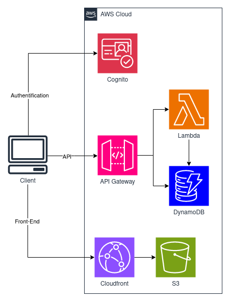

# POMO.CAFE

A study tool for using the pomodoro study technique. By default the study timer is set
for 25 minutes but users can customize the length of time. Authenticated users can track their progress
using the stats page. Users can customize their experience with various options on the
settings page.

Visit at [pomo.cafe](https://pomo.cafe)

## About

The frontend of this project is mainly composed of svelte. 
Cognito User Pools are used to authenticate users that have signed up.
Authenticated users are able to view their stats with a d3.js data visualization.
The backend is handled by sending api requests to API Gateway. Some requests are authenticated and sent
directly to DynamoDB while others are sent to Lambda.

